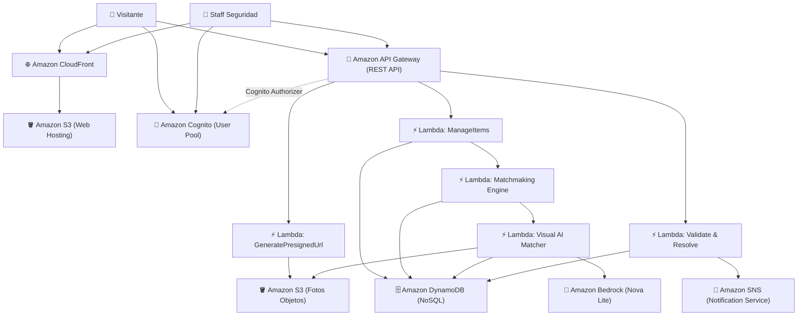

# 📄 Documentación Técnica y Funcional: Lost & Found Mall Portal

**Proyecto de Hackathon:** Plataforma Inteligente de Gestión y Devolución de Objetos Perdidos para Centros Comerciales  
**Autor:** Steven Alfredo Relayza Perez  
**Institución:** Universidad Tecnológica del Perú (UTP)  
**Entorno de Nube:** Amazon Web Services (AWS - Región `us-east-1`)  

---

## 📌 1. Resumen Ejecutivo del Proyecto

**Lost & Found Mall Portal** es una solución web **100% Serverless** construida sobre la nube de **Amazon Web Services (AWS)**, diseñada para transformar el proceso tradicional de recepción, custodia y entrega de objetos perdidos en centros comerciales (*malls*). 

La plataforma conecta en tiempo real a dos actores clave:
1. **Personal de Seguridad / Staff del Mall:** Registra hallazgos físicos de objetos en las distintas áreas del centro comercial con fotos y ubicaciones exactas.
2. **Visitantes / Clientes:** Reportan pérdidas con descripciones y datos de contacto.

Un **motor inteligente de Inteligencia Artificial en AWS Lambda y Amazon Bedrock (Nova Lite `amazon.nova-lite-v1:0`)** analiza tanto las fotografías reales como las descripciones textuales y atributos, calcula el porcentaje de coincidencia (*match score* con clasificación visual `ALTA`, `MEDIA`, `BAJA`) y, una vez que el personal de seguridad valida el reclamo, genera un **Pase de Recojo Seguro con Código QR** y notifica automáticamente al usuario vía **Amazon SNS**.

---

## ☁️ 2. Servicios de AWS Utilizados y su Función

### 1. **Amazon S3 (Simple Storage Service)**
* **Alojamiento Web Estático (*Static Website Hosting*):** Sirve la aplicación web completa (`index.html`, `styles.css`, `app.js`) de forma ultrarrápida, escalable y con costo casi nulo.
* **Almacenamiento de Fotografías (*Media Storage*):** Almacena las imágenes reales de los objetos subidas por los guardias o visitantes.
* **Carga Segura mediante URLs Prefirmadas (*Presigned URLs*):** El frontend solicita permiso a una Lambda para subir archivos binarios directamente a S3, evitando saturar el API Gateway y garantizando transferencias eficientes.

### 2. **Amazon Cognito (User Pools & Identity)**
* **Autenticación y Autorización:** Gestión segura de identidades de usuarios (visitantes y personal de seguridad).
* **Control de Acceso Basado en Roles (RBAC):** Uso de grupos de Cognito (`STAFF` vs `Customer`) para delimitar quién puede validar reclamos y quién puede registrar pérdidas.
* **Seguridad de Sesiones:** Emisión de tokens **JWT (ID Token)** que autentican cada solicitud HTTP hacia el backend.
* **Flujo de Primer Inicio:** Soporte para desafío de cambio obligatorio de contraseñas temporales (`newPasswordRequired`).

### 3. **Amazon API Gateway (REST API)**
* **Punto de Entrada Unificado (Endpoint Base):** `https://zhylygp2y7.execute-api.us-east-1.amazonaws.com/dev`
* **Endpoints Implementados:**
  * `POST /upload-url`: Genera URLs prefirmadas para subida de fotos a S3.
  * `POST /items`: Registra objetos perdidos (`LOST`) y encontrados (`FOUND`).
  * `GET /items`: Consulta el inventario de reportes activos desde DynamoDB.
  * `GET /matches`: Obtiene las coincidencias calculadas entre reportes.
  * `PATCH /matches/{id}/validate`: Aprueba o descarta un reclamo y dispara la notificación.
* **Cognito Authorizer:** Valida automáticamente el token JWT en cada petición antes de invocar las Lambdas.

### 4. **AWS Lambda (Cómputo Serverless)**
* Ejecuta la lógica del backend sin servidores dedicados.
* **Algoritmo de Matching Multicriterio:** Compara reportes `LOST` y `FOUND` considerando:
  * Coincidencia de Categoría.
  * Ubicación / Zona del Mall.
  * Proximidad temporal (Fechas).
  * Similitud textual en descripciones (análisis de palabras clave y similitud semántica).

### 5. **Amazon DynamoDB (Base de Datos NoSQL)**
* Almacena de forma persistente y con latencia de milisegundos:
  * **Tabla de Items:** Registros de objetos perdidos y encontrados con metadatos (título, categoría, zona, fecha, descripción, URLs de fotos y estado).
  * **Tabla de Matches:** Relaciones de coincidencia detectadas, porcentaje de similitud (`matchScore`), criterios cumplidos y estado de validación (`POSSIBLE`, `VALIDATED`, `REJECTED`).

### 6. **Amazon SNS (Simple Notification Service)**
* **Notificaciones Event-Driven (Pub/Sub):** Envío automatizado de alertas de correo al visitante cuando el personal de seguridad valida que un objeto encontrado le pertenece.
* Notificación de citas de recojo con instrucciones del centro de atención al cliente.

### 7. **Amazon CloudFront (Content Delivery Network - Opcional)**
* Distribución global de baja latencia con certificados SSL/HTTPS y memoria caché en el borde para servir los archivos de S3.

---

## 🚀 3. ¿Qué hace la Aplicación hasta el Momento? (Funcionalidades)

### A. Experiencia Pública / Landing Page
* **Diseño SaaS Moderno:** Inspirado en la interfaz de **Sync Labs**, con degradados suaves celestes (`#cbebfd` $\to$ blanco) y tipografía refinada (*Plus Jakarta Sans*).
* **Interruptor de Modo Claro / Modo Oscuro:** Switch superior con iconos de Sol/Luna que almacena la preferencia del usuario en `localStorage`.
* **Galería de Áreas del Mall:** Tarjetas visuales de alta resolución para *Patio de Comidas, Tiendas Comerciales, Estacionamientos y Cines*.
* **Métricas de Impacto Social:** Indicadores de éxito (+1,250 objetos devueltos, 94% efectividad, <24h tiempo de respuesta).
* **Registro Directo de Visitantes:** Formulario completo para nuevos usuarios con Nombre, Email, DNI, Teléfono, Contraseña y aviso de suscripción a notificaciones por Amazon SNS.

### B. Portal de Gestión (Staff & Cliente)
* **Detección Automática de Rol:** La aplicación adapta su interfaz según los grupos de Cognito:
  * **Vista Cliente:** Muestra "Reportar Objeto Extraviado" y filtra únicamente "Mis Reportes".
  * **Vista Personal de Seguridad (Staff):** Muestra "Registrar Objeto Encontrado", pestaña de "Reportes Generales" y pestaña de "Coincidencias (Matches)".
* **Formulario Dinámico de Registro:**
  * Categorías predefinidas + Campo de texto dinámico al elegir **"Otros"**.
  * Zonas del mall predefinidas + Campo de texto dinámico al elegir **"Otra Zona..."**.
  * Selector de fecha y descripción detallada.
  * Carga de imagen con previsualización y subida automática a Amazon S3.
* **Visualización de Reportes en 2 Columnas (Grid Paralelo):**
  * Presentación lado a lado de tarjetas con diseño limpio.
  * Asignación automática de **fotografías temáticas HD por categoría** (Billeteras, Celulares, Mochilas, Joyas, Ropa, Laptops, Llaves y Otros) cuando no se adjunta foto personalizada.
* **Barra de Filtros Homogéneos y Activos:**
  * `📋 Todos` (por defecto)
  * `⏳ Pendientes`
  * `✓ Validados`
  * `📦 Entregados`
* **Módulo de Coincidencias de Seguridad:**
  * Agrupación de candidatos por objeto encontrado.
  * Visualización del porcentaje de coincidencia.
  * Botones con delegación de eventos para **"✓ Validar"** y **"✕ Descartar"**.
* **Pase de Recojo Seguro con Código QR Anti-Fraude:**
  * Modal de alta visibilidad que genera un código QR único con los datos del reclamo.
  * Muestra el punto de entrega físico (*Módulo Central de Seguridad - Piso 1*), horarios de atención y recordatorio de portar el DNI físico.

---

## 💼 4. Propuesta de Valor para el Centro Comercial (Pitch Hackathon)

1. **Transformación de la Experiencia del Visitante (NPS):** Convierte una mala experiencia (perder algo de valor) en un momento de fidelización hacia el centro comercial.
2. **Cero Fraudes y Trazabilidad:** Todo objeto queda registrado digitalmente con fecha, custodio, fotos y entrega auditada mediante DNI y Código QR.
3. **Eficiencia Operativa:** Descongestiona las colas y llamadas en el módulo de atención al cliente.
4. **Arquitectura Serverless de Bajo Costo:** Al basarse en AWS Lambda, DynamoDB y S3, el costo operativo mensual es extremadamente bajo, pagando solo por las transacciones reales generadas.
